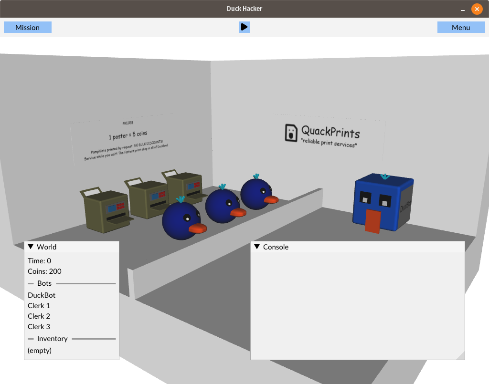
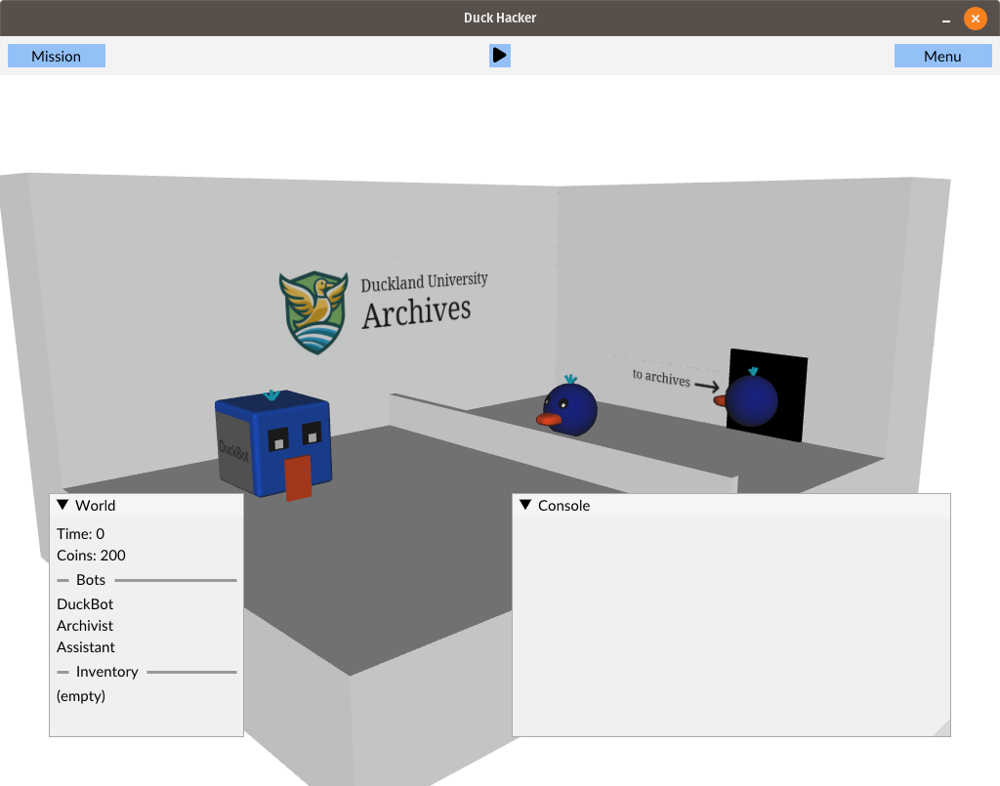

# duck-hacker

	
	

Duck Hacker is a game where you hack various things by programming DuckBots, small robots that run Lua code.

The game is written in C++ and uses OpenGL for rendering. The code is based on [tigame](https://github.com/thatoddmailbox/tigame)'s rendering engine, but with many internal changes.

SDL2 is also used to set up a window and initialize OpenGL. wxWidgets runs in a separate thread to provide the source code editor. Additionally, all bots run their Lua code in individual threads.

## Building
Make sure to run `git submodule update --init --recursive` to clone the submodules, as some dependencies are included that way.

Then, follow the build instructions for your platform:
* [Windows build instructions](./docs/build-windows.md).
* [Linux build instructions](./docs/build-linux.md).

## Credits
### Graphics used
Either I made them or they were generated with the Bing AI image creator. You can probably tell which is which.

### Music used
* Adding the Sun by Kevin MacLeod, https://incompetech.com
* Ethernight Club by Kevin MacLeod, https://incompetech.com
* Jingle_Win_Synth_01, https://freesound.org/people/LittleRobotSoundFactory/sounds/274179/
* Space 1990 by Kevin MacLeod, https://incompetech.com

### Libraries used
* dear imgui
* glad
* glm
* libpng
* lua
* pugixml
* SDL
* SDL_mixer
* PhysicsFS